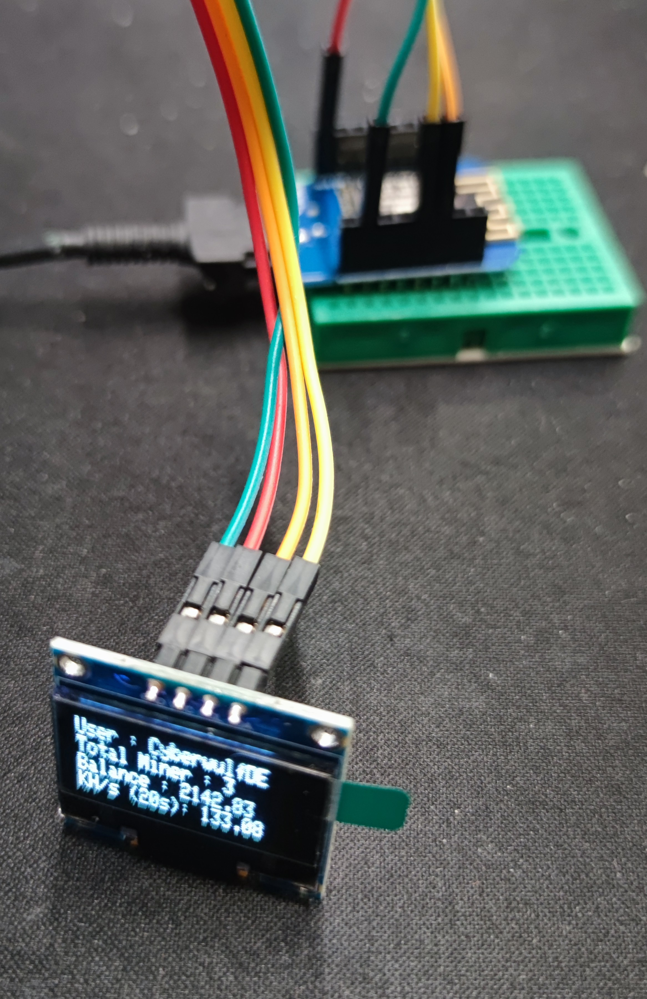
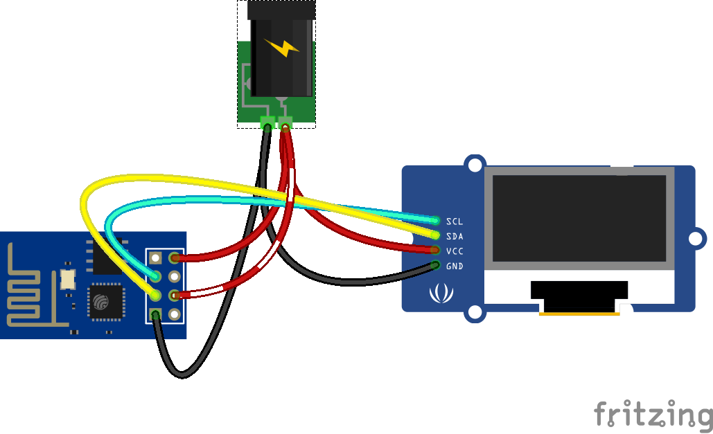

# Duino Coin Monitor OLED Display



# Install Library:
1. Install Library Arduino core for ESP8266 <br>
   `- https://github.com/esp8266/Arduino`
3. Install Library Arduino core for the ESP32 <br>
   `- https://github.com/espressif/arduino-esp32`
5. Install Library : <br>
`- https://github.com/adafruit/Adafruit_BusIO`<br>
`- https://github.com/adafruit/Adafruit_SSD1306`<br>
`- https://github.com/adafruit/Adafruit-GFX-Library`<br>
`- https://github.com/bblanchon/ArduinoJson` (use V6) <br>

# OLED Display Software Setup:

1. OLED Display Screen Resolution, Change to your OLED display width and height.
```
#define SCREEN_WIDTH 128 // OLED display width, in pixels
#define SCREEN_HEIGHT 32 // OLED display height, in pixels
```
2. OLED I2C ADDRESS
```
#define SCREEN_ADDRESS 0x3C
```
    - use 0x3D if screen resolution 128x64 pixel
    - use 0x3C if screen resolution 128x32 pixel

3. USEESP01
```
#define USEESP01 0
```
    - use 1 for ESP01 using
    - use 0 for nomal Dev Board like WemosD1 or simular

4. WiFi and Duino User
```
const char *ssid = "YOUR_SSID"; // Change this to your WiFi SSID
const char *password = "YOUR_SSID_PASSWORD"; // Change this to your WiFi password
const String ducoUser = "YOUR_DUINO_USERNAME"; // Change this to your Duino-Coin username
```

# Wiring:
Change SDA and SCL accordingly with your board, this example with Wemos D1 Mini, ESP01 and DevKit V1

|| ESP8266(Wemos) | ESP01 | ESP32 | OLED |
|:-:| :----: | :----: | :----: | :-----: |
||3.3V | 3.3V | 3.3V | VCC |
||GND | GND | GND | GND |
|`SCL`|D1 (GPIO5) | GPIO0 | GPIO22| SCL |
|`SDA`|D2 (GPIO4) | GPIO2 | GPIO21 | SDA |

# Update :
I added here support for ESP01. Also in resources folder are the wiring.



# Else :
Feel free to modify, optimize and/or add yours. 

# Misc :
Dont be confuse with OLED screen size, there are two common size :
   - OLED 1.3" Display (128x64)
   - OLED 0.96" Display (128x32)

**if you having difficulty on ESP8266 pin reset D4, replace it with -1, for ESP01 use 1 (in new code setup USEESP01 to 1)

# Tips on Linux:
If you get the error that you have no access to port /dev/ttyUSB? than change temporary you permission with:

```
sudo chown <username>:<group> /dev/ttyUSB2
```

change < username > and < group > to yours (mostly group: dialout or uucp)
